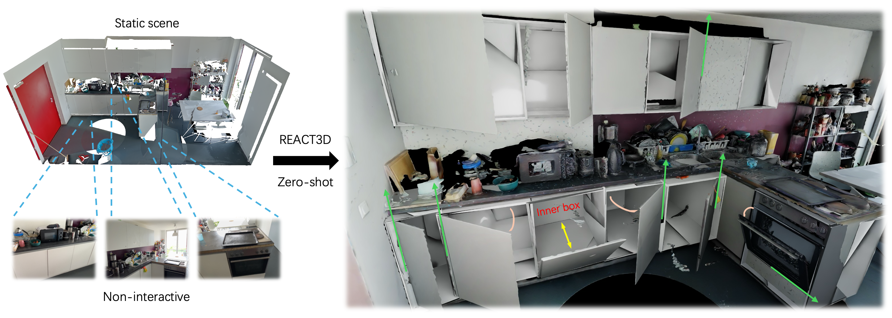

# REACT3D: Recovering Articulations for Interactive Physical 3D Scenes


<div align="center">
<a href="https://react3d.github.io/"></a>
<a href="https://arxiv.org/abs/2510.11340" target="_blank" rel="noopener noreferrer"> </a>
<!-- <a href="https://drive.google.com/file/d/1PuDanf0JnpyCRtiurPIESG80pU_nEBIj/view"> </a> -->

<p>
    <a href="https://troyehuang.github.io/">Zhao Huang</a>   
    ·
    <a href="https://boysun045.github.io/boysun-website/">Boyang Sun</a>
    · 
    <a href="https://alexdelitzas.github.io/">Alexandros Delitzas</a>
    ·
    <a href="https://www.linkedin.com/in/chen-jiaqi/">Jiaqi Chen</a>
    ·
    <a href="https://people.inf.ethz.ch/pomarc/">Marc Pollefeys</a>
</p>


</div>

Interactive 3D scenes are increasingly vital for embodied intelligence, yet existing datasets remain limited due to the labor-intensive process of annotating part segmentation, kinematic types, and motion trajectories. We present REACT3D, a scalable zero-shot framework that converts static 3D scenes into simulation-ready interactive replicas with consistent geometry, enabling direct use in diverse downstream tasks.

## Setup

### Installation

Clone the repository and install necessary dependencies：

```bash
git clone https://github.com/troyehuang/REACT3D.git --recursive
cd REACT3D

conda create -n react3d python==3.10
conda activate react3d

# change for your machine
export TORCH_CUDA_ARCH_LIST="7.5 8.0 8.6 8.9"

pip install ninja
pip install torch==2.1.2+cu121 torchvision==0.16.2+cu121 --extra-index-url https://download.pytorch.org/whl/cu121

# groundingDINO
set BUILD_WITH_CUDA=True
set CUDA_HOME=<your_path>
set AM_I_DOCKER=False

cd grounded_sam/GroundingDINO
python setup.py build
python setup.py install

# scene2part
cd ../..
pip install git+https://github.com/NVlabs/tiny-cuda-nn/#subdirectory=bindings/torch --no-build-isolation
pip install "git+https://github.com/facebookresearch/pytorch3d.git@stable" --no-build-isolation
pip install kaolin -f https://nvidia-kaolin.s3.us-east-2.amazonaws.com/torch-2.1.2_cu121.html
pip install git+https://github.com/NVlabs/nvdiffrast.git --no-build-isolation

pip install -r requirements.txt

# part2interactive
pip install 'git+https://github.com/facebookresearch/detectron2.git' --no-build-isolation

cd opdformer/mask2former/modeling/pixel_decoder/ops
python setup.py build install

```

We updated the code to use Qwen3.5 instead of LLaVA.
Install the environment for Qwen3.5:
```bash
conda create -n react3d_qwen python==3.10
conda activate react3d_qwen

pip install transformers
```

Install checkpoints:
```bash
cd REACT3D

# ram++ checkpoint
cd ram++
wget --no-check-certificate https://huggingface.co/xinyu1205/recognize-anything-plus-model/resolve/main/ram_plus_swin_large_14m.pth

# grounded sam checkpoint
cd ../grounded_sam
wget https://dl.fbaipublicfiles.com/segment_anything/sam_vit_h_4b8939.pth
wget https://github.com/IDEA-Research/GroundingDINO/releases/download/v0.1.0-alpha/groundingdino_swint_ogc.pth

# opdm checkpoint
cd ../part2interactive
wget --no-check-certificate https://huggingface.co/3dlg-hcvc/opdmulti-motion-state-rgb-model/resolve/main/pytorch_model.pth -O {REACT3D_dir}/part2interactive/opdm_rgb.pth
```

### Data Preparation
We evaluate our work on [ScanNet++](https://github.com/scannetpp/scannetpp) augmented by [Articulated3D](https://github.com/insait-institute/USDNet) and [MultiScan](https://github.com/smartscenes/multiscan) datasets. For convenience, we provide an [example input scene](https://drive.google.com/file/d/1i7BwzsvcVXlbCpmStOlC_dPT-CUMZo2u/view?usp=sharing) and the corresponding [output](https://drive.google.com/file/d/1TKSeXdMsBuKDKMxbx2dYizlcQqRoyFJD/view?usp=sharing). The interactive 3D demo for this output is shown in our [project page](https://react3d.github.io/#interactive-demo).

*Note: For computational efficiency, the provided example scene has been downsampled: the image resolution is reduced by half, and the frame sequence is sub-sampled by extracting every 5th frame. Please be aware that these factors may impact the final quality of the reconstructed results.*


To use custom data, please follow the structure of the `example_input_scene` to process your own scenes. Make sure the your input data format is the same as the example data.

The `example_input_scene` folder is organized as follows:
```bash
example_input_scene
|---images_2
|---mesh_aligned_0.05.ply
|---pose_intrinsic_imu.json
|---depth
```

## Quick Start

To run the script on a specific scene, use:

```bash
cd REACT3D

# remember to change the paths in each script
cd scene2part
bash scene2part.sh

cd ../part2interactive
bash part2interactive.sh

cd ../texture
bash generate_texture.sh

cd ../simulation_ready
bash simulation_ready.sh

```

## Progress
- [x] Project Page online
- [x] Initial code released
- [x] Example input scene and output data
- [x] Performance optimization for Scene2Part module
- [x] Upgrade from LLaVA to Qwen3.5
- [x] Viser interface
- [ ] Texture

## Acknowledgements
Our work is based on [OPDMulti](https://github.com/3dlg-hcvc/OPDMulti) and [DRAWER](https://github.com/xiahongchi/DRAWER). We thank the authors for their great work and open-sourcing the code.

## Citation
If you find our work useful, please consider citing:
```
@ARTICLE{11434845,
  author={Huang, Zhao and Sun, Boyang and Delitzas, Alexandros and Chen, Jiaqi and Pollefeys, Marc},
  journal={IEEE Robotics and Automation Letters}, 
  title={REACT3D: Recovering Articulations for Interactive Physical 3D Scenes}, 
  year={2026},
  volume={},
  number={},
  pages={1-8},
  keywords={Three-dimensional displays;Joints;Geometry;Image reconstruction;Estimation;Solid modeling;Point cloud compression;Foundation models;Biological system modeling;Accuracy;Semantic scene understanding;object detection;segmentation and categorization;RGB-D perception},
  doi={10.1109/LRA.2026.3674028}
}
```
